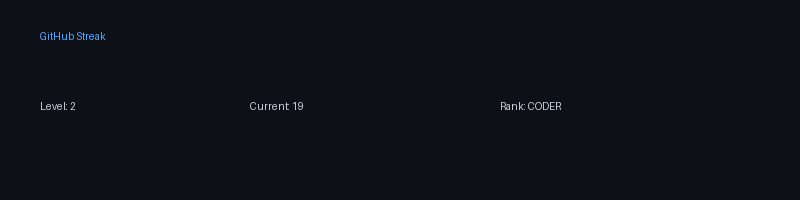

<!-- <a href="https://git.io/streak-stats"></a> -->

</a>

<!--START_SECTION:waka-->

```txt
Python       57 mins         █████████▓░░░░░░░░░░░░░░░   38.92 %
Markdown     54 mins         █████████░░░░░░░░░░░░░░░░   36.64 %
YAML         8 mins          █▒░░░░░░░░░░░░░░░░░░░░░░░   05.97 %
Text         7 mins          █▒░░░░░░░░░░░░░░░░░░░░░░░   05.30 %
JSON         6 mins          █░░░░░░░░░░░░░░░░░░░░░░░░   04.41 %
```

<!--END_SECTION:waka-->

Just testing this:

<!--START_SECTION:streak-->




<!--END_SECTION:streak-->
